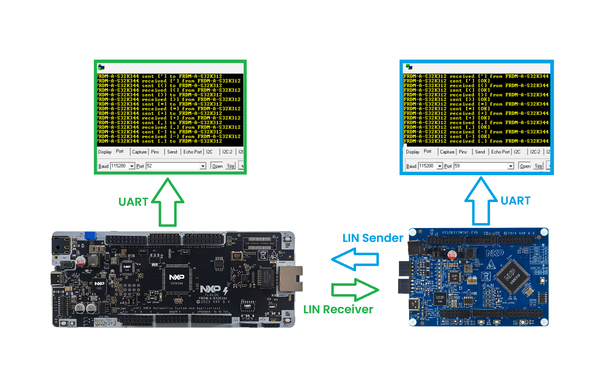
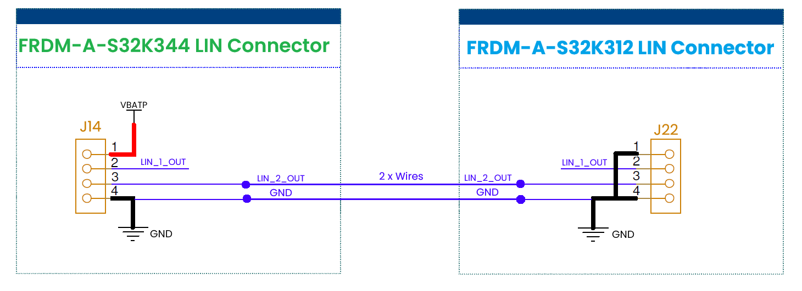
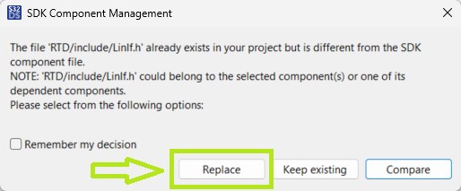

# NXP Application Code Hub
[](https://www.nxp.com)

## LIN Communication Example
This example showcases LIN diagnostic communication between two NXP FRDM-A-S32K3 boards using the AUTOSAR LIN stack and NXP RTD drivers. The FRDM-A-S32K312 acts as a LIN Sender and periodically sends an ASCII character through transport-layer diagnostic messages, while the FRDM-A-S32K344 acts as a LIN Receiver and returns the subsequent ASCII character. The transmitted and received values are displayed on the UART console, providing a simple demonstration of LIN Transport Layer request-response communication.
[<p align="center"></p>](./images/FRDM-A-S32K312-LIN-Sender-FRDM-A-S32K344-Receiver.png)

#### Boards: FRDM-A-S32K312, FRDM-A-S32K344
#### Categories: Networking
#### Peripherals: UART, LIN
#### Toolchains: S32 Design Studio IDE

## Table of Contents
1. [Software and Tools](#step1)
2. [Hardware](#step2)
3. [Setup](#step3)
4. [Results](#step4)
5. [Support](#step5)
6. [Release Notes](#step6)

## 1. Software and Tools<a name="step1"></a>
This example was developed using the FRDM Automotive Bundle for S32K3 + S32M27. To download and install the complete software and tools ecosystem, use the following links:
- [ FRDM Automotive S32K3 + S32M27 Board Installation Package](https://www.nxp.com/app-autopackagemgr/automotive-software-package-manager:AUTO-SW-PACKAGE-MANAGER?currentTab=0&selectedDevices=S32K3&applicationVersionID=203)
- Serial terminal program (for example: PuTTy, Tera Term, RealTerm etc.)

## 2. Hardware<a name="step2"></a>
### 2.1 Required Hardware
- Personal Computer
- Type-C USB cable

| Boards | Images |
| ------ | ------ |
| - [FRDM-A-S32K312](https://www.nxp.com/design/design-center/development-boards-and-designs/FRDM-A-S32K312) |  |
| - [FRDM-A-S32K344](https://www.nxp.com/design/design-center/development-boards-and-designs/FRDM-A-S32K344) |  |

### 2.2 Hardware Connections
- Connect FRDM-A-S32K344's LIN2 pin (J14-3) to FRDM-A-S32K312's LIN2 pin (J22-3)
- Connect FRDM-A-S32K344's GND  pin (J14-4) to FRDM-A-S32K312's GND  pin (J22-4)
[<p align="center"></p>](./images/FRDM-A-S32K344_LIN_to_FRDM-A_S32K312.png)

### 2.3 Debugger Connection
- Connect the Type-C USB cable to PC and FRDM-A-S32K312 board for power supply and debugging.
- Connect the Type-C USB cable to PC and FRDM-A-S32K344 board for power supply and debugging.

## 3. Setup<a name="step3"></a>

### 3.1 Import the Project into S32 Design Studio IDE
1. Open S32 Design Studio IDE, in the Dashboard Panel, choose **Import project from Application Code Hub**.
   [<p align="center"></p>](./images/import_project_1.png)

2. You can find the demo you need by searching for the name directly
3. Open the project, click the **GitHub link**, S32 Design Studio IDE will automatically retrieve project attributes, then click **Next>**.
    [<p align="center"></p>](./images/import_project_3.png)

4. Select **main** branch and then click **Next>**.

5. Select your local path for the repo in **Destination->Directory:** window. The S32 Design Studio IDE will clone the repo into this path, click **Next>**.

6. Select **Import existing Eclipse projects** then click **Next>**.

7. Select the 2 projects in the repository then click **Finish**.

### 3.2 Generating, Building and Running the Example

1. In Project Explorer, right-click on each project and select **Update Code and Build Project**. This will generate the configuration (Pins, Clocks, Peripherals), update the source code and build the project using the active configuration (e.g. Debug_FLASH).
Make sure the build completes successfully and the *.elf file is generated without errors.
[<p align="center"></p>](./images/update_and_build.png)
2. If during this process a pop-up appears asking whether or not to replace or keep the existing LIN configuration files, it's very important to select **Replace**, otherwise build issues may occur.
[<p align="center"></p>](./images/build_project_1.png)
#### Debugging the projects
Go to **Debug** and select **Debug Configurations**. Select **GDB PEMicro Interface Debugging**:
[<p align="center"></p>](./images/DebugConfigurations.png)

Use the controls to control the program flow.

> Note: The GDB PEMicro Interface Debugging configuration uses a default ports 6224 and 7224. In example are provided 2 debug configurations, one with default ports and another one with custom ports to support debugging of 2 boards simultaneously on the same PC. In one launch configuration, select one board (for example USB1) and in the second launch configuration, select the other board (for example USB2).

## 4. Results<a name="step4"></a>
Open a serial terminal on the enumerated COM port (typical settings: 115200 baud, 8 data bits, no parity, 1 stop bit, no flow control).  
The LIN Sender (FRDM-A-S32K312) begins cycling through the printable ASCII range and the LIN Receiver (FRDM-A-S32K344) echoes back the next character. Each node prints the character it sent or received together with the transport-layer transfer status.

On the __FRDM-A-S32K312__ terminal you should see:

```javascript
FRDM-A-S32K312 sent [A] [OK]
FRDM-A-S32K312 received [B] from FRDM-A-S32K344
FRDM-A-S32K312 sent [B] [OK]
FRDM-A-S32K312 received [C] from FRDM-A-S32K344
FRDM-A-S32K312 sent [C] [OK]
FRDM-A-S32K312 received [D] from FRDM-A-S32K344
...
```

On the __FRDM-A-S32K344__ terminal you should see:

```javascript
FRDM-A-S32K344 received [A] from FRDM-A-S32K312
FRDM-A-S32K344 sent [B] to FRDM-A-S32K312
FRDM-A-S32K344 received [B] from FRDM-A-S32K312
FRDM-A-S32K344 sent [C] to FRDM-A-S32K312
FRDM-A-S32K344 received [C] from FRDM-A-S32K312
FRDM-A-S32K344 sent [D] to FRDM-A-S32K312
...
```

The FRDM-A-S32K312 transmits one character per LIN schedule cycle over the transport layer (MasterReq frame `0x3C`, SID `0x23`). The FRDM-A-S32K344 receives it, increments the value by one, and returns it in the response frame (SlaveResp `0x3D`, RSID `0x63`). The transmitted character advances through the printable ASCII range (`0x20`..`0x7F`) and wraps back to `0x20` (space) after `0x7F`, so the two terminals stay one character apart and loop continuously. An `[OK]` status confirms each transport-layer transfer completed successfully (`LD_COMPLETED`); an `[FAIL]` would indicate a bus or timing error.

## 5. Support<a name="step5"></a>
For general technical questions related to NXP microcontrollers, please use the [NXP Community Forum](https://community.nxp.com/).
#### Project Metadata

<!----- Boards ----->
[](https://mcuxpresso.nxp.com/appcodehub?hwBoard=FRDM-A-S32K312)
[](https://mcuxpresso.nxp.com/appcodehub?hwBoard=FRDM-A-S32K344)

<!----- Categories ----->
[](https://mcuxpresso.nxp.com/appcodehub?category=networking)

<!----- Peripherals ----->
[](https://mcuxpresso.nxp.com/appcodehub?peripheral=uart)
[](https://mcuxpresso.nxp.com/appcodehub?peripheral=lin)

<!----- Toolchains ----->
[](https://mcuxpresso.nxp.com/appcodehub?toolchain=s32_design_studio_ide)

Questions regarding the content/correctness of this example can be entered as Issues within this GitHub repository.

>**Note**: For more general technical questions regarding NXP Microcontrollers and the difference in expected functionality, enter your questions on the [NXP Community Forum](https://community.nxp.com/)

[](https://www.youtube.com/NXP_Semiconductors)
[](https://www.linkedin.com/company/nxp-semiconductors)
[](https://www.facebook.com/nxpsemi/)
[](https://x.com/NXP)

## 6. Release Notes<a name="step6"></a>
| Version | Description / Update                           | Date                           |
|:-------:|------------------------------------------------|-------------------------------:|
| 1.0     | Initial release on Application Code Hub        | September 16<sup>th</sup> 2026 |
